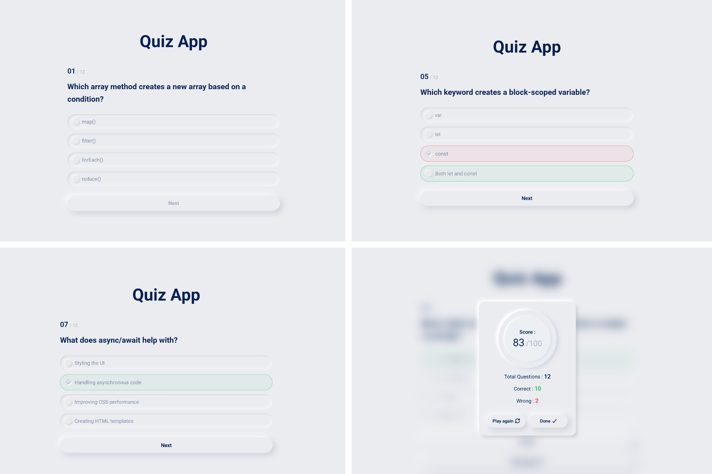

# Quiz App

Interactive Quiz App built with **HTML, CSS, and JavaScrip** where users answer questions, get instant feedback, and see their final score in a result modal.


## Live Demo

🔗 **View Online:**  
https://dorsa-piraneh.github.io/quiz-app/

## Screenshots




## Features

- Dynamic question rendering
- Answer validation (correct / wrong state)
- Score calculation
- Result modal with quiz statistics
- Quiz reset / play again
- Loader on initial load
- Neumorphism UI design


## Installation & Usage

### Option 1: Run Locally (No Git Required)
1. Download the project as ZIP.
2. Extract the files.
3. Open `index.html` in your browser.

### Option 2: Clone with Git
```bash
git clone https://github.com/dorsa-piraneh/quiz-app.git
```
Then open `index.html` in your browser.

## Project Structure

```txt
quiz-app/
│   index.html
│   LICENSE
│   README.md
│
├───assets
│   ├───fonts
│   │   └───Roboto
│   │
│   ├───icons
│   │   └───FontAwesome
│   │
│   └───images
│           Screenshot.png
│
├───css
│       main.css
│
└───js
        data.js
        main.js
```

## Technologies Used

- HTML & CSS
- JavaScript (ES6+)
- Git & Github

## Future Improvements

- Add timer per question.


## Author

**Dorsa Piraneh**  
GitHub: https://github.com/dorsa-piraneh
